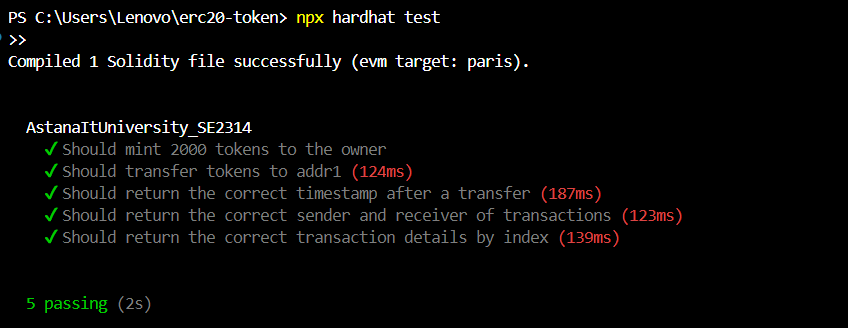

# AstanaItUniversity_SE2314

AstanaItUniversity_SE2314 is a smart contract implementing an ERC-20 token with additional functionality to retrieve and display transaction details.

---

## 📋 Description

This smart contract includes the basic functionalities of an ERC-20 token with additional features for transaction handling:
- **Initialization:** Upon deployment, 2000 tokens are created and assigned to the contract creator.
- **Transaction Logging:** Every transaction is logged in an event with detailed information.
- **Transaction Information Retrieval:**
  - Sender address.
  - Receiver address.
  - Timestamp of the last transaction in a readable format.

---

## 🔧 Setup

### Clone the Repository

```bash
git clone https://github.com/your-repository.git
cd your-repository
```


---

### Install Dependencies

```bash
npm install
```


---

### Run Tests

```bash
npx hardhat test
```



---

### Deploy to Local Network

Run a local blockchain (e.g., Ganache), then deploy the contract:

```bash
npx hardhat run scripts/deploy.js --network ganache
```


---

## 🗒 Usage Examples

### Check Balance

Retrieve the token balance of the owner:

```javascript
const balance = await token.balanceOf(owner.address);
console.log("Balance:", ethers.utils.formatUnits(balance, 18));
```


---

### Transaction Example

Transfer 100 tokens to another address:

```javascript
await token.transfer(addr1.address, ethers.utils.parseUnits("100", 18));
```


---

### Retrieve Transaction Information

1. Get the sender address of the last transaction:

   ```javascript
   const sender = await token.getTransactionSender();
   console.log("Sender address:", sender);
   ```

   

2. Get the receiver address of the last transaction:

   ```javascript
   const receiver = await token.getTransactionReceiver();
   console.log("Receiver address:", receiver);
   ```

   

3. Get the timestamp of the last transaction:

   ```javascript
   const timestamp = await token.getTransactionTimestamp();
   console.log("Last transaction timestamp:", timestamp);
   ```

   

4. Retrieve transaction details by index:

   ```javascript
   const txn = await token.getTransaction(0); // Index of the first transaction
   console.log("Transaction details:", txn);
   ```

   

---

## 📷 Screenshots

Here are the key screenshots of the project setup and execution:

1. Clone repository:
   

2. Install dependencies:
   

3. Run tests:
   

4. Deploy contract:
   

5. Example usage:
   - Check balance.
   - Perform a transaction.
   - Retrieve transaction details.

